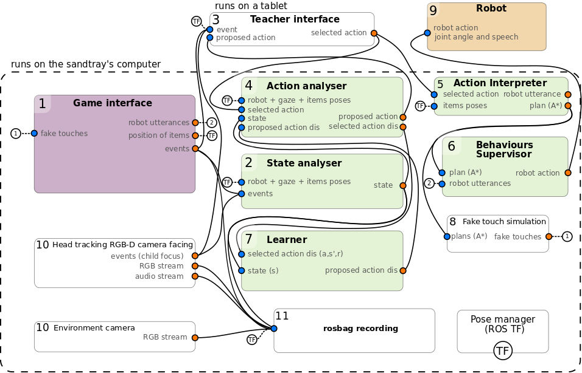

Robot Learning Tutoring Study -- Robot Controller
=================================================

*This work is heavily based on Séverin Lemaignan's [Free-play Sandbox](
https://github.com/freeplay-sandbox/core). It is designed to be used with the
[Food Chain Game](https://github.com/emmanuel-senft/freeplay-sandbox-qt) and the [Teacher's interface](https://github.com/emmanuel-senft/freeplay-sandbox-qt-supervisor).*


This repository contains  the ROS code for the robot controller for the
'Robot Learning Tutoring' study.


Installation
------------

*For the entirety of this guide, I will assume you are running Ubuntu Linux on
the touch screen (hereafter named 'sandtray'). In particular, **Windows is not
(and can not be easily) supported**.*

If not yet installed, start by [installing
ROS](http://wiki.ros.org/ROS/Installation) (tested with ROS Kinetic, but
other versions might work as well).

This repository also requires the messages defined [here](https://github.com/emmanuel-senft/freeplay-sandbox-msgs).

Then:

```
> git clone https://github.com/emmanuel-senft/freeplay-sandbox-ros-sparc
> cd freeplay-sandbox-ros-sparc
> mkdir build && cd build
> cmake -DCMAKE_BUILD_TYPE=Release ..
> make install
```

Architecture
-----------
This image represents a highly simplified version of the control architecture
for the study. In reality, more topics are present, the action interpreter and
behaviours supervisor are different nodes (cf. `woz_play`, `sandbox_map_and_plan`,
`move_sandbox_items`, `woz_play` and `nao_behaviour`) and the learner is the `actor` node.



Usage
-----

First, start `roscore` in a dedicated terminal.

### Starting the food chain game

- start the [game](https://github.com/emmanuel-senft/freeplay-sandbox-qt)
  (from QtCreator for instance) (conditions: supervised, passive or autonomous
  can be changed by pressing three times on the corners of the screen).

- `roslaunch freeplay_sparc interactive_playground.launch`

This launch file:

- broadcasts the sandtray 3D model + camera frames
- builds an occupancy map based on the positions of the objects within the game,
and provide a  A\*-based path planning service to move around said objects
- creates an action server to move sandbox objects to specific positions,
using the path planner
- creates a node to receive actions from the teacher's GUI and have the robot
 execute them
- creates a static frame for the robot, assuming it is facing the child on the
top of the sandtray

### Starting the teacher's GUI

On a different computer, such as a tablet, start the [teacher's GUI](https://github.com/emmanuel-senft/freeplay-sandbox-qt-supervisor) (from QtCreator for instance) (be careful the set the ROS_MASTER_IP to the touchscreen, where all
  the other nodes and the roscore are running).

This GUI allows the teacher to see the state of the game, select actions for the
robot and react to its suggestions.


### Starting the robot controller (Nao)

```
$ export NAO_IP=<the IP of the Nao>
$ roslaunch freeplay_sparc robot_controller.launch
```

### Start SPARC

This enable the robot to learn from the teacher's selection and propose actions
to the teacher.

```
$ rosrun freeplay_sparc sparclauncher
```

This script starts the `sparc.launch` files at the start of the interaction and
stops it at the end.

Depending of the condition, this launch file starts the set of nodes required
for a passive robot, a supervised one learning from the teacher or an autonomous
one.

In the supervised condition, it launches the following nodes:
- `action_analyser` which also starts the `state_analyser.py`. These two nodes
interpret the state of the game and the action selected by the teacher or
proposed by the algorithm.
- `actor` which learns from the teacher's selections and can propose actions

In the autonomous condition, the `autoexe` node is also started to automatically
accept the algorithm's suggestion after a short delay.


### Tracking visual focus

Gaze tracking is performed by an independent ROS node,
[gazr](https://github.com/severin-lemaignan/gazr). Install it first, making sure
you enable the ROS support. You will also need a camera, preferably
[calibrated](http://wiki.ros.org/camera_calibration/Tutorials/MonocularCalibration)
(otherwise, the gaze localisation will not be accurate at all). For quick
testing with a desktop webcam, you can download and install the
[gscam](https://github.com/ros-drivers/gscam) driver.

Once gaze tracking work, you can run:

```
$ roslaunch freeplay_sparc focus_gaze.launch
```

This launch file:

- starts the `gscam` webcam driver (you might want to set the argument `camera_info_url` to point to
  the calibration file of your webcam).
- starts `gazr`
- computes the intersection between the estimated gaze direction and the
  sandtray.
- sends a message informing if the child is looking at the robot, the screen or
outside.

This intersection, ie the current visual focus of the participant, can be
visualised on the teacher's interface.

Data recording
--------------

This code can use `rosbag` to record the interaction data and the camera and
audio feeds. A script `recorder` can use the `record.launch` launch file to
start the recording when the interaction starts and stop it at the end of the
interaction. This `recorder` file can be edited to change the location of the
rosbag. By default it will store files in Documents/foodchain-data and expects in that folder a `bag` folder and a `video` folder, with each three subfolders for
the three conditions: `condition-nosparc-normal`, `condition-sparc-autonomous`
and `condition-sparc-normal`.


```
$ rosrun freeplay_sparc recorder
```

The launch file `record.launch` configure and execute `rosbag` to record the
relevant topic. [See the
source](https://github.com/emmanuel-senft/freeplay-sandbox-ros-sparc/blob/task/launch/record.launch)
for the exact list of recorded topics.

Be aware that the bag file become quickly rather big (expect 150MB/minute).

Nodes documentation
-------------------
### state_analyser

`state_analyser` is the node interpreting the state of the game and of the child.
It takes as input position of each item and interaction events and creates a 210
dimensional vector of values between 0 and 1 that can be used for the learning.

### action_analyser

`action_analyser` is used to convert the actions selected by the teacher (such
as moving the eagle to the coordinate x, y while also selecting the snake) to
a discrete action (move the eagle close to the snake). It also converts the
discrete actions from the algorithm to a continuous action executable by the
robot (for example by selecting a set of coordinates for the goal position of a
movement) and proposes it to the teacher through the teacher's interface.

### woz_play

`woz_play` get as input continuous actions and uses sandbox_map_and_plan to
create a trajectory for the action and create a sentence for the robot to
describe what it is currently doing.

### actor

`actor` uses an algorithm adapted from the Nearest Neighbours to learn a tutoring
policy from the current state of the game and actions rewarded by the teacher.
It can propose actions to the teacher through the action_analyser.

### nao_behaviour

`nao_behaviour` is a bridge between ROS and naoqi. It receive pointing gestures
or strings and call the related naoqi functions to have the robot interact in
the real world.

### sandbox_map_and_plan

`sandbox_map_and_plan` first wait for the shapes of everything single
sandbox items to be published as marker arrays. By default, listen to the
`/footprints` topic.

After this initial step, it listen over ROS TF for the position of each of the
items, and generate an occupancy map. **Note that the size and resolution of the
map is currently hard-coded to 60x33.5cm, 5cm per cell**.

It then exposes a planning service (`plan_motion`) that uses the A\*
algorithm to plan a path to move an item from A to B.
Upon completion the resulting path is as well published on
the `/sandbox_manipulation_path` topic, for visualisation in RViz.


### move_sandbox_items

This nodes exposes a ROS action server (`move_sandbox_items`) that waits for
a goal (item name, target position), calls the planner, and 'executes' the
motion by publishing a sequence of ROS poses corresponding to virtual touches of
the robot on the surface of the GUI, causing the robot to actually move items
around.
